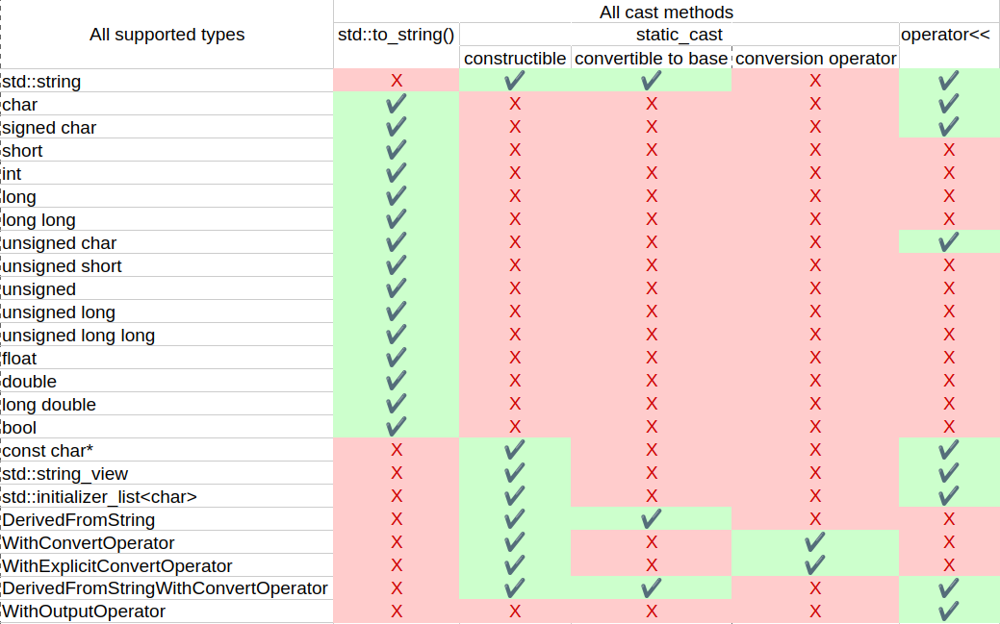
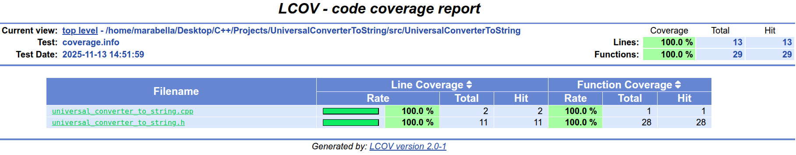

# Universal converter to std::string

Универсальная библиотека для преобразования любых типов C++ в **std::string** с проверкой возможности конвертации на этапе компиляции.

## Проблема:

В C++ отсутствует единый интерфейс для конвертации произвольных типов в строку. Разные категории типов требуют различных подходов:

Категория типов                                       |   Метод конвертации
------------------------------------------------------|---------------------------------------------------
**Арифметические типы(int, double, ...)**	          |   **std::to_string**
**Строковые типы(C-style строки, std::string_view)**  |   Прямой конструктор
**Пользовательские типы**	                          |   Оператор **std::string()** или оператор **\<\<**

### Определение множества характеристик типа, обладая которыми возможна конвертация

1. Функция **std::to_string** имеет явную/неявную перегрузку для типа,

    **Например:** int, double, etc.

2. Объект класса **std::string** может быть явно/неявно **сконструирован** с помощью типа,

    **Например:** C-style строки, std::string_view, etc.

3. Тип является **наследником** класса **std::string**,

    **Например:**

    ~~~cpp
    class DerivedFromString : public std::string {};
    ~~~

4. Тип определяет **оператор приведения** к **std::string**,

    **Например:**

    ~~~cpp
    class WithConvertOperator {
    public:
        operator std::string() const { return "convert operator"; }
    };
    ~~~

5. Для типа определен **оператор вывода в поток**.

    **Например:**

    ~~~cpp
    class WithOutputOperator {
    public:
        friend std::ostream& operator<<(std::ostream& os, const WithOutputOperator&) { 
            os << "output operator";
            return os; 
        }
    };
    ~~~

### Определение способов конвертации

В языке есть несколько стандартных способов сконвертировать значение произвольного типа T к std::string:

1. **std::to_string(T value) поддерживает:**

   - T обладающий характеристикой**№1**.

2. **static_cast\<std::string\>(value) поддерживает:**

   - T обладающий характеристикой**№2**,

   - T обладающий характеристикой**№3**,

   - T обладающий характеристикой**№4**.

3. **operator\<\<(std::ostream os, T value) поддерживает:**

   - T обладающий характеристикой**№5**.

### Определение множества поддерживаемых типов

1. **std::to_string**:

    Ссылаясь на **cppreference**, в стандартной библиотеке определены **явные** перегрузки функции:

    ~~~cpp
    std::string to_string( int value );                 (1)	(since C++11)
    std::string to_string( long value );                (2)	(since C++11)
    std::string to_string( long long value );           (3)	(since C++11)
    std::string to_string( unsigned value );            (4)	(since C++11)
    std::string to_string( unsigned long value );       (5)	(since C++11)
    std::string to_string( unsigned long long value );  (6)	(since C++11)
    std::string to_string( float value );               (7)	(since C++11)
    std::string to_string( double value );              (8)	(since C++11)
    std::string to_string( long double value );         (9)	(since C++11)
    ~~~

    Под эти определения так же **неявно** подходят:

    ~~~cpp
    char, signed char, unsigned char,
    short, unsigned short,
    bool
    ~~~

2. **Компоненты для std::string**:

    Ссылаясь на **cppreference**, конструктор класса **std::string**, перегружен от следующих компонент:

    ~~~cpp
    basic_string( const CharT* s, const Allocator& alloc = Allocator() ); (7)

    basic_string( std::nullptr_t ) = delete; (8) (since C++23)

    template< class StringViewLike >
    explicit basic_string( const StringViewLike& t, const Allocator& alloc = Allocator() ); (9) (since C++17)

    basic_string( std::initializer_list<CharT> ilist, const Allocator& alloc = Allocator() ); (19) (since C++11)
    ~~~

    Так же есть перегрузки от: **char**, **InputIt**, etc. Но они **не подходят** из-за специфики задачи, так как требуют **больше одного аргумента**.

3. **Наследник класса std::string**:

    С этого момента тип объекта, а также все его производные будут называться или включать в своем названии префикс **DerivedFromString**.  

4. **Тип с оператором приведения к std::string:**

    С этого момента тип объекта, а также все его производные будут называться или включать в своем названии префикс **WithConvertOperator**.  

5. **Тип с оператором вывода в поток**:

    С этого момента тип объекта, а также все его производные будут называться или включать в своем названии префикс **WithOutputOperator**.  

6. **А также составные типы, использующие раннее определенные типы:**

    Самые интересные экземпляры: 

    - **WithExplicitConvertOperator** - определяет **explicit** оператор приведения.

    - **DerivedFromStringWithConvertOperator** - наследник класса **std::string**, с оператором приведения.

### Таблица поддерживаемых типов и их характеристик

**type_requirements_analyzer** - программа с помощью которой были получены данные для таблицы.

## Установка

### Требования

Перед установкой убедитесь, что у вас установлены следующие зависимости:

- **C++ компилятор** (GCC/Clang)

- **CMake** (версия 3.19 и выше)

### Шаги для установки

1. **Клонируйте репозиторий:**

    ~~~bash
    git clone https://github.com/marabella070/UCTS.git
    cd UCTS
    ~~~

2. **Создайте директорию для сборки:**

    ~~~bash
    mkdir build && cd build
    ~~~

3. **Запустите CMake для генерации Makefile (или другого файла сборки):**

    Для генераторов **одной конфигурации**:

    ~~~bash
    cmake -G "Unix Makefiles" -DCMAKE_BUILD_TYPE=Release ../
    ~~~

    Для генераторов **мультиконфигурации**:

    ~~~bash
    cmake -G "Xcode" ../
    ~~~

4. **Соберите проект:**

    Для генераторов **одной конфигурации**:

    ~~~bash
    cmake --build . --target all --target instant_tests
    ~~~

    Для генераторов **мультиконфигурации**:

    ~~~bash
    cmake --build . --config Release --target all --target instant_tests
    ~~~

### Запуск

После успешной сборки, вы можете запустить:

1. **Пример использования библиотеки:**

    ~~~bash
    ./bin/instant_tests
    ~~~

2. **Тесты:**

    ~~~bash
    ./bin/universal_converter_to_string_traits_tests && ./bin/universal_converter_to_string_tests
    ~~~

    или 

    ~~~bash
    ctest
    ~~~

## Покрытие кода

Полную информацию о покрытии кода можно найти в папке CoverageReport в корне проекта.

Актуальные данные о покрытии кода **исходной библиотеки**:

